Managing versions of your work is one of the most important activities when it comes to working efficiently, for reproducibility, and when collaborating with others. You're probably already familiar with the basic idea of version control through Microsoft Word or Powerpoint via OneDrive and SharePoint. Many people who develop software use a *distributed version control software* to manage their work, which means each developer works on their own, local copy of a given project and synchronizes through a centralized server.

The most common and our recommended distributed version control software for coding is [**Git**](https://en.wikipedia.org/wiki/Git). Unlike with OneDrive and Sharepoint, Git's version control is not automatic. Instead, you must log your changes manually every so often and explicitly send your changes up to a Git server so that collaborators can see and retrieve them.

Git operates on collections of files, usually grouped into a single folder, which we call a **repository** (or "repo"). The idea is to have one repo per project. Git is optimized to work with text-based files, such as code, csv files, and the like.[^1]

[^1]: Git can still track more complex file types, like Word documents or Excel spreadsheets, but some features, like easily comparing file versions with [`diffs`](#making-changes), will not be as easy to use.

To get started with Git, start by [installing it](../extras/install-git.qmd).

## GitLab and GitHub

To collaborate with others using Git, you must sync your repository to a *Git server*. A Git server offers a central "home" in the cloud that collaborators can interface with asynchronously:

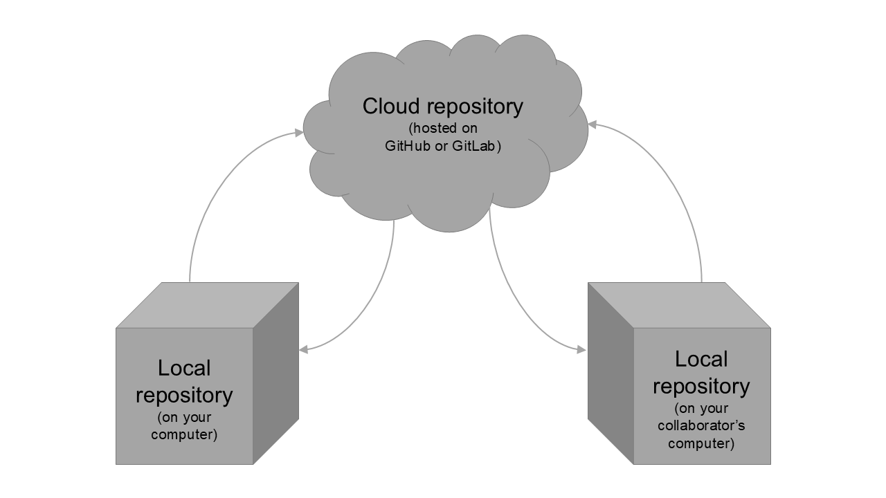

There are two main "flavours" of Git server software: GitHub and GitLab. These software are largely similar, with one important exception; GitLab can be run on a private server, whereas GitHub is only offered by Microsoft at [github.com](https://github.com).

### Access control

A repository can be *public* (accessible to anyone with access to the Git server), or *private* (accessible only to registered users who have been granted access).

Granting repository access to individual users may work well for smaller projects, but it quickly becomes impractical at scale. To manage access for many users at once, GitHub and GitLab offer [Organizations](https://docs.Github.com/en/organizations/collaborating-with-groups-in-organizations/about-organizations) and [Groups](https://docs.gitlab.com/ee/topics/set_up_organization.html) respectively. Organizations and Groups are essentially "shared accounts" or "containers" for projects that offer sophisticated security and administrative features.

Importantly, Organizations and Groups move repos to unique project URLs. Personal repositories are located at `examplegitserver.com/user-name/repo-name`. Organization and Group repositories are located at `examplegitserver.com/organization-name/repo-name`. Organizations and Groups are particularly useful for project branding and continuity; the same URL can be used for the life of the project, even as users join or leave over time.

To learn more about administering organizations and groups, see the [GitLab Groups and GitHub Organizations](../extras/admin-git-groups.qmd) page.

### GitLab and GitHub docs

This guide gives an introduction to using GitHub and GitLab when developing projects, but you may wish to occasionally consult the documentation for either product for more advanced usage:

-   [GitLab docs](https://docs.gitlab.com/)
-   [GitHub docs](https://docs.github.com/en)

## Git basics {#git-basics}

There are a few fundamental actions that you will use often with Git, which we outline here.

### Creating a new repository for your project

When starting a new project, you will likely want to **create a new repository** to house your project files. We recommend that the project lead create the first copy of your repo **in the cloud**, *i.e.* on GitLab or GitHub via a web browser, after deciding which remote home to use for this particular project.

Instructions for creating a new repo can be found [here for GitLab](https://docs.gitlab.com/ee/user/project/) and [here for GitHub](https://docs.Github.com/en/repositories/creating-and-managing-repositories/creating-a-new-repository). We recommend that you initialize your new repository with a [README](readmes.qmd) and and a [license file](../deployment-and-maintenance/licenses.qmd) and be mindful of the visibility level for your repository.

To invite collaborators, follow [these instructions for GitLab](https://docs.gitlab.com/ee/user/project/members/) and [these instructions for GitHub](https://docs.Github.com/en/account-and-profile/setting-up-and-managing-your-personal-account-on-Github/managing-access-to-your-personal-repositories/inviting-collaborators-to-a-personal-repository).

Once the cloud repository is created, the project lead and all collaborators should create a local, synchronized copy (or "clone") of the project on their computers in order to be able to work on the project files. To clone the project, you need to first decide how you will interact with Git on your computer, which we discuss in the next section. (We discuss how to actually clone a repository in a subsequent section.)

### Git clients

Git is fundamentally a command line program and some users simply interface with it via the command line. When you install Git, you will see a new app called Git Bash, which gives you a command line interface to Git. However, it is generally easier to interact with Git primarly via a client with a graphical user interface (GUI). These can either be standalone programs or bundled within an integrated development environment (like RStudio or VSCode).

The Git website includes a list of [Git GUI Clients](https://Git-scm.com/downloads/guis). We recommend using [GitHub Desktop](https://desktop.Github.com/) as a starting point. It is one of the few cross-platform open source Git GUI clients. Despite its name, GitHub Desktop works with all Git servers, including GitLab.

This guide will demo instructions for basic Git use via GitHub Desktop. If you prefer to learn how to use Git via the command line, you should consult [this command line guide on the official Git site](https://git-scm.com/book/en/v2/Getting-Started-The-Command-Line).

### Cloning a repository

Now that you've created a new repository in the cloud, you need to **clone it locally** to your computer so that you can work on the repo's files. This action copies the current files and Git history to your computer, and creates a link between your copy and the main copy in the cloud (in this case called the "origin" repository).

**We strongly recommend against cloning code repositories to OneDrive or Sharepoint locations**, as these services block the synchronization of certain code files for security reasons. Using OneDrive or Sharepoint locations for your code repositories can lead to only some files being backed up in the Microsoft cloud, along with annoying and persistent notifications from the OneDrive/Sharepoint app telling you that there is a synchronisation issue and to remove certain files. Instead, we recommend creating a folder in your local user folder (`C:/Users/USERNAME`) to house all Git repos. GitLab and GitHub both store a separate copy of your repository in the cloud, so you still inherently are backing up your work on an external device.

To clone a **GitHub** repo in GitHub Desktop:

1.  In GitHub Desktop, go to `File > Options... > Accounts` and sign into your GitHub account (if you're not already signed in).
2.  Go to your repository on github.com, and click the big green "Code" button. Select "Open in GitHub Desktop".
3.  Choose a local path where you’d like the repository clone and click "Clone".

### Ignoring files

Not all files should be tracked by Git, including:

-   sensitive data files that must only be stored locally
-   generated temporary files that collaborators can (and will) be easily recreated when they run the code
-   files over 100 MB (GitHub's file transfer limit)

We can use `.gitignore` file to avoid including these files in the repository's file history as well as pushing them up to the cloud.

A `.gitignore` is a text file usually kept at the top level of your repository. Git will ignore any files that match names and patterns listed in a `.gitignore` file, meaning that the files will not be tracked. It is a good practice to ignore these files as soon as possible after creating your repository, to avoid accidentally synchronizing them to a Git server.

One way to ignore files is by right-clicking them in the "Changes" pane of GitHub Desktop and selecting one of the ignore options, either "ignore this file" or "ignore all files with the same extension":

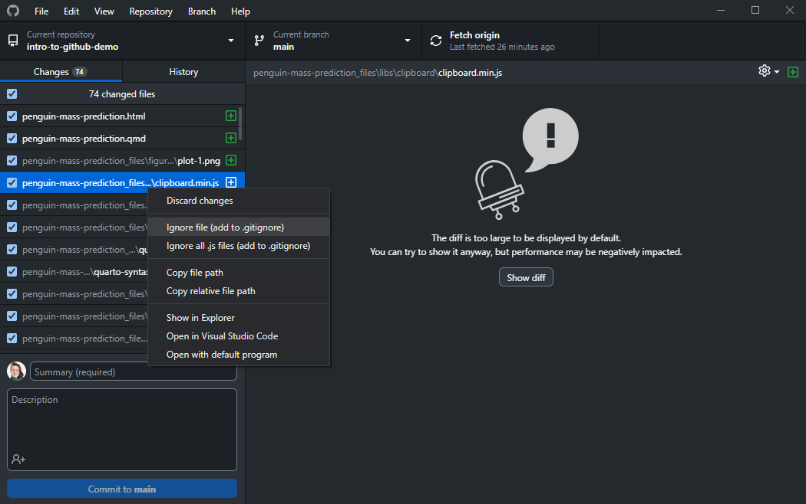 

Once you ignore your first file, you will see the new `.gitignore` file in Windows Explorer:

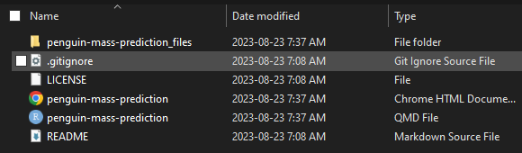

You can open `.gitignore` and simply type in filenames and patterns to new lines in the file, as opposed to right-clicking files individually in GitHub Desktop. You can find rules for populating your `.gitignore` file [here](https://Git-scm.com/book/en/v2/Git-Basics-Recording-Changes-to-the-Repository#_ignoring).

Another option is to start with a template `.gitignore` file with commonly-ignored file types for your project's programming language(s), which you can generate easily using [gitignore.io](https://www.toptal.com/developers/gitignore).

### Making changes {#making-changes}

Now that your repository is available to you locally, you can start developing your code. Every time you make changes to your files (create/delete/edit a file), you will see them reflected in GitHub Desktop, under the Changes tab:

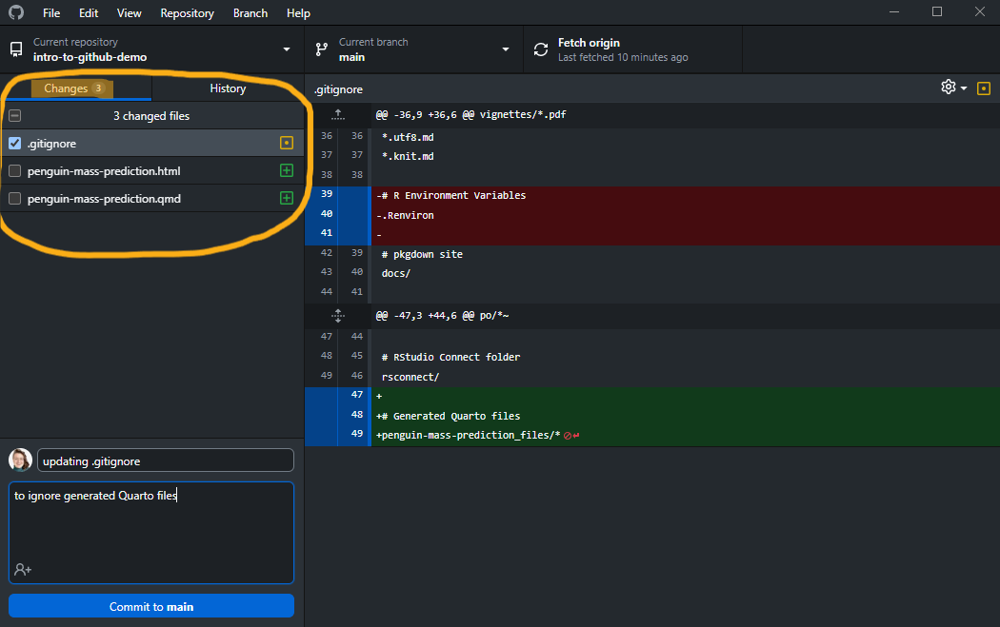

Changes are shown relative to the last snapshot, *i.e.*, relative to the last **commit** to the repository. The green plus to a file means a file was added, the yellow dot means a file was modified, and a red minus means a file was deleted. When a change is listed but unchecked, it is "unstaged", and when it is checked it is "staged" in preparation for making a commit.

In either case, these changes have been made, but they have not been committed to the version history of the repository. You can see the changes in detail on the right-hand side, in the **diff** view: green lines have been added and red lines have been deleted relative to the last snapshot (commit) of the code.

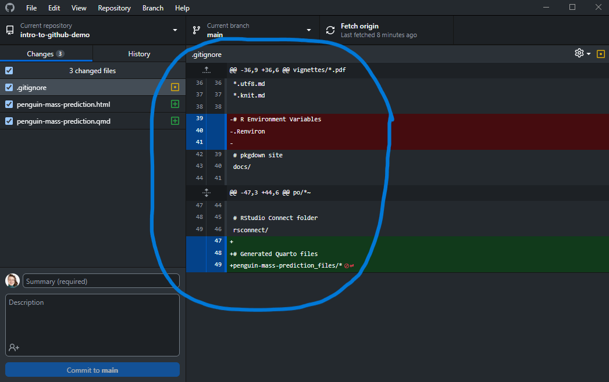

You can stage entire files by checking them, or just some lines in a file by selecting/deselecting lines in the diff view.

Once you have selected the changes you want to bundle together for your snapshot, write a commit message to summarise the changes in the lower left of the app window and click the Commit button:

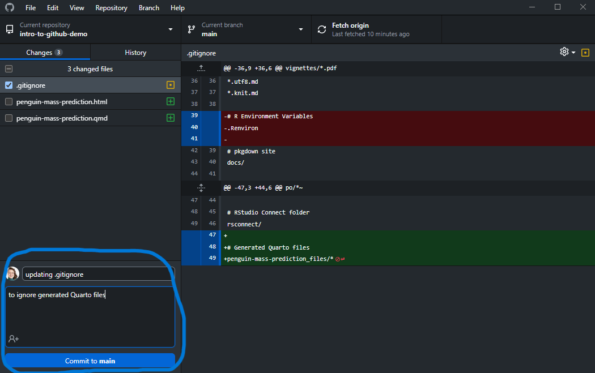

The main commit message is mandatory and should provide a short summary of your changes. The additional description is optional.

Once committed, you will see this latest change, and all others before it in the History pane:

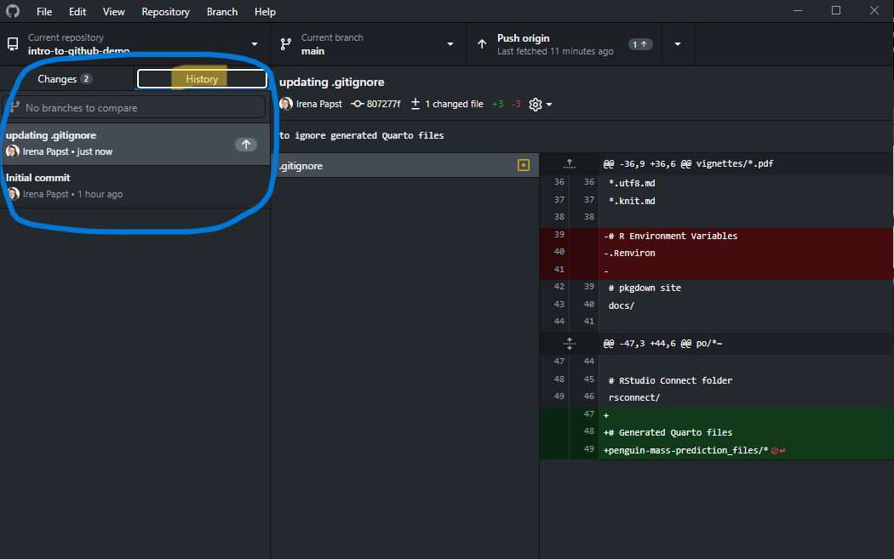

For more on writing commit messages, see the [Writing commit messages](../extras/writing-commit-messages.qmd) page.

### Removing files from tracking

If you've accidentally committed a file that you want to ignore, just adding the file to the `.gitignore` will not work to ignore the file. You must first **remove the file from tracking**, and then adding it to the `.gitignore` will take effect. GitHub Desktop does not have a feature to remove files from tracking, so we must do it from the command line.

Open up the Git Bash program and navigate to your repository's directory using

```         
cd path/to/directory
```

where you'd fill `path/to/directory` in with an absolute path to your project repo.[^2]

[^2]: A simple way to find an absolute path to your repo is to select the folder in Windows Explorer (select, not open) and then in the Home ribbon, click the "Copy path" button. You would then paste the copied path into Git Bash after the `cd` command using `Shift+Ins` or by right-clicking and clicking Paste. Be sure to remove the quotes around the path before hitting enter!

Now that you are in your project's repository, you can remove a file from tracking with

```         
git rm path/to/file
```

For instance, if I wanted to remove a file called `data.csv` from the top level of my repository, I would do

```         
git rm data.csv
```

Now if you were to add this file to the `.gitignore`, it would actually be ignored!

To purge an accidentally committed file from your GitHub repository, you'll need to follow [these instructions](https://docs.Github.com/en/authentication/keeping-your-account-and-data-secure/removing-sensitive-data-from-a-repository).

### Synchronizing

Note the little up arrow beside the latest commit from our previous example:

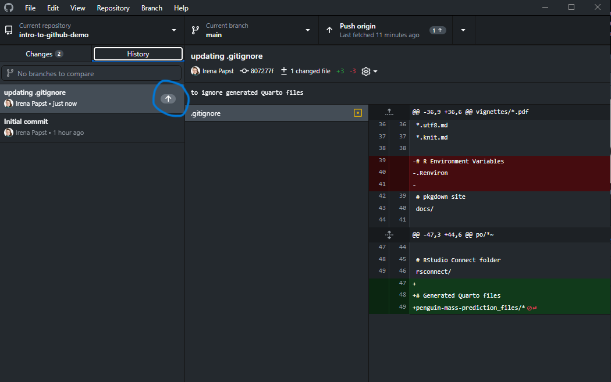

The arrow indicates that some changes we committed have yet to be sent up to the cloud repository. Commits only log changes to your *local* file history. To send your changes to the cloud repository, you must **push** them up:

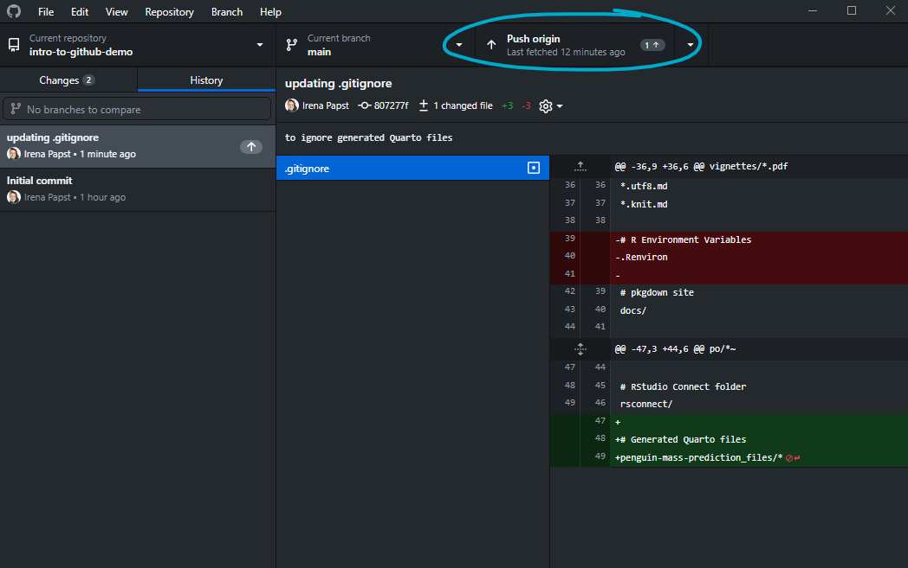

If you are working on two computers or collaborating with others, you will want to periodically sync in the opposite direction and retrieve any changes from the cloud repository. We start with a **fetch** to check for any changes available online:

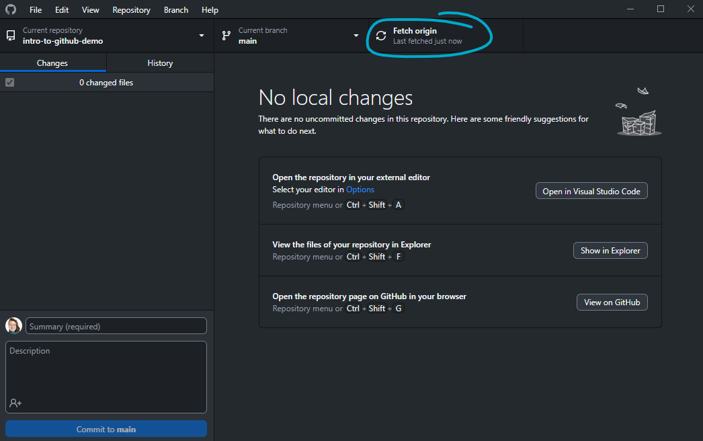

If changes are present, GitHub Desktop shows us how many new commits are available (just one here) and we get the option to **pull** them down to our local copy:

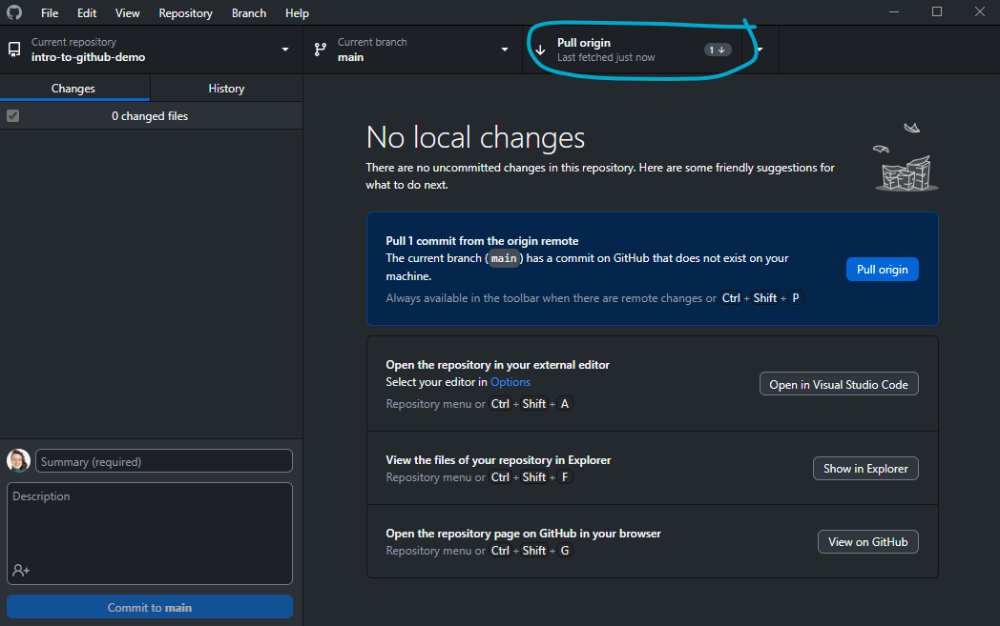

### Branching

#### Understanding branches

Branches are a way of working on your files in a way that is isolated from other versions of your code. The default branch is `main` and should be thought of as the "live" version of your code; you should avoid making changes directly to your code on `main` unless you are confident that your changes won't break anything. Instead, experimentation and development should be done on another branch, especially when you are collaborating with others to avoid clashing with their changes in an uncontrolled way. Branches can be merged into one another at any point in time to reconcile changes.

This paradigm comes from the world of software development and it may very well be overkill for a solo research project. However, it can be very useful when collaborating with others, and we recommend a common Git workflow that uses branches [below](#Github-flow).

We can visualise branching to understand it better. Imagine your file history as a timeline with a series of commits denoting snapshots of your code:

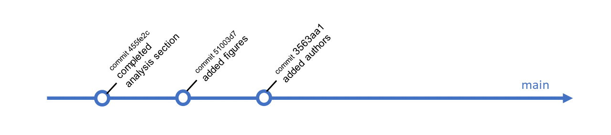

This history is of a repository where some authors are collaborating on a manuscript together. One author decides to add a section on methods, but does not want to disrupt the work of others, so they make a branch:

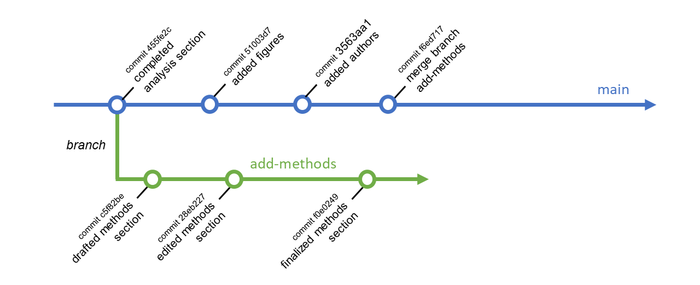

This author branched off of `main` at a commit with message "completed analysis section". The `add-methods` branch history starts at that change. Changes can continue to be made to `main`, but `add-methods` will not include them (unless they are explicitly pulled into `add-methods`). In this way, branching enables work in parallel.

When work on the `add-methods` branch is complete, these changes can be pulled into `main` with a **pull request** (or "**merge request**" on GitLab).

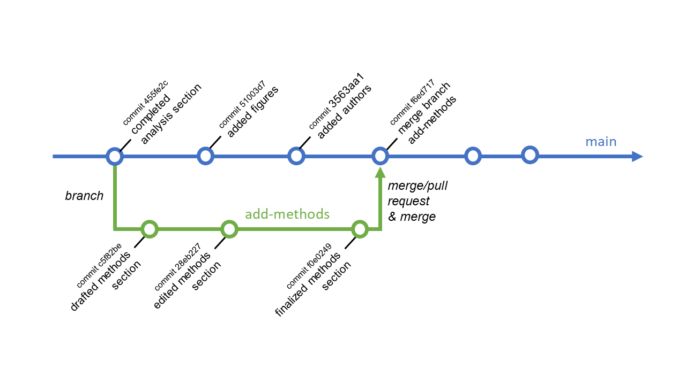

The idea is to formally request a pull into `main` and allow for a review and approval process before the merge is complete. Before being able to accept a pull request from `add-methods` into `main`, any additional changes to `main` must be merged into the `add-methods` branch first. Here, that means adding commit numbers `51003d7` "added figures" and `3563aa1` "added authors" to `add-methods`. This is a precaution to avoid **merge conflicts**.

Git will automatically attempt to resolve these changes and generally does a good job at this unless conflicting changes happen to be made to the same part of a file. If Git detects conflicting changes, it will create a merge conflict between the branches, where it will add text to the conflicted files flagging where conflicts are.

In the example above, imagine that we have a file called `authors.qmd` and we are trying to pull changes to this file from `add-method` into `main`. Someone working on `main` put the line "The authors of this code are unknown." (with commit number `3563aa1` "added authors") in this file, and in parallel someone working on `add-methods` put "The authors of this code are wonderful people!" (with commit number `28eb227` "edited methods section") in the same line of this file. These are conflicting changes that Git would not know how to reconcile, so the pull request into `main` would be blocked. Instead, Git would flag the conflict by inserting the following text into `authors.qmd`:

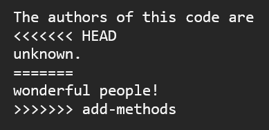

Conflicts are sandwiched between the markers `<<<<<<<` and `>>>>>>>`. You can find them easily by searching the conflicted file for `<` characters. Git will insert both proposed changes divided by `=======`, and it will label where each change came from. In the example above, the top change comes from `HEAD`, and the bottom change comes from the `add-methods` branch. `HEAD` is a generic term for the tip of the branch you're currently working on. If you are merging `add-methods` into `main`, you would do that from the `main` branch, so here `HEAD` would be `main`.

To resolve the conflict, simply erase everything between and including the conflict markers except the change you want to keep. In the above example, if we were to accept the change from `add-methods`, the resolved conflict would just look like:


#### Working with branches

To make a branch in GitHub Desktop, start by opening the branch pane by clicking on the current branch in the top middle of the app window, and then click the "New branch" button:

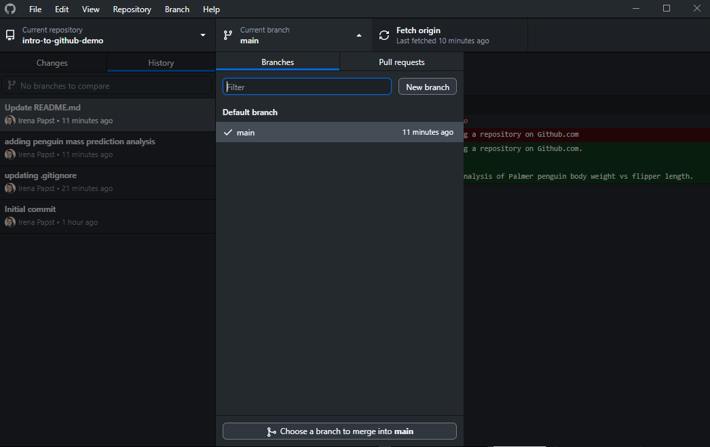

You new branch will start from the tip of the branch you're currently on so be sure to first select and synchronize the branch you want to start from before clicking "New branch". The "New branch" button will open a pop-up where you will input a name for your new branch:

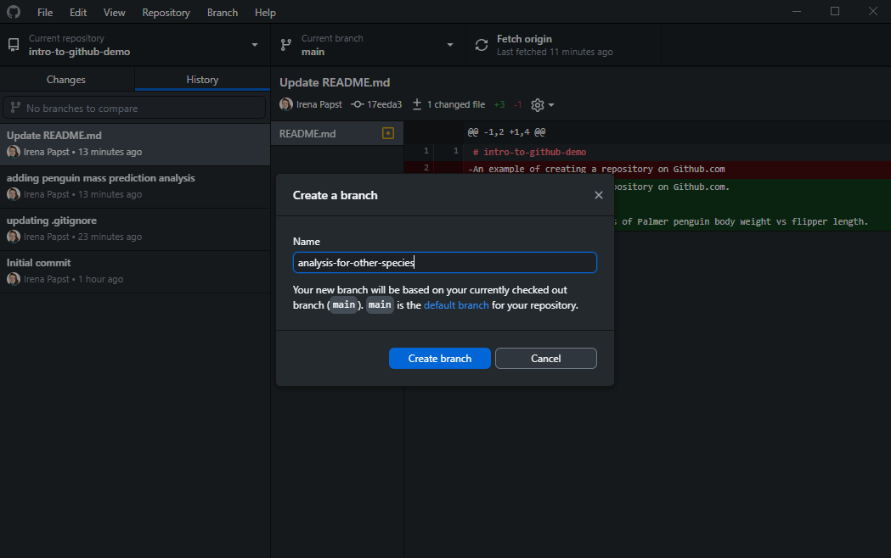

It is good practice to use a concise and descriptive name that quickly conveys the goal of the work on the new branch. Once you create the branch, it will only be created locally; you must push it up to the cloud repository yourself, by selecting the "Publish branch" button that will be available:

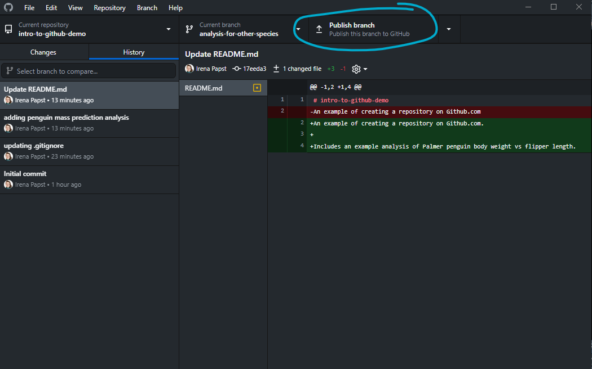

Once you've done that, you will be able to see your branch online:

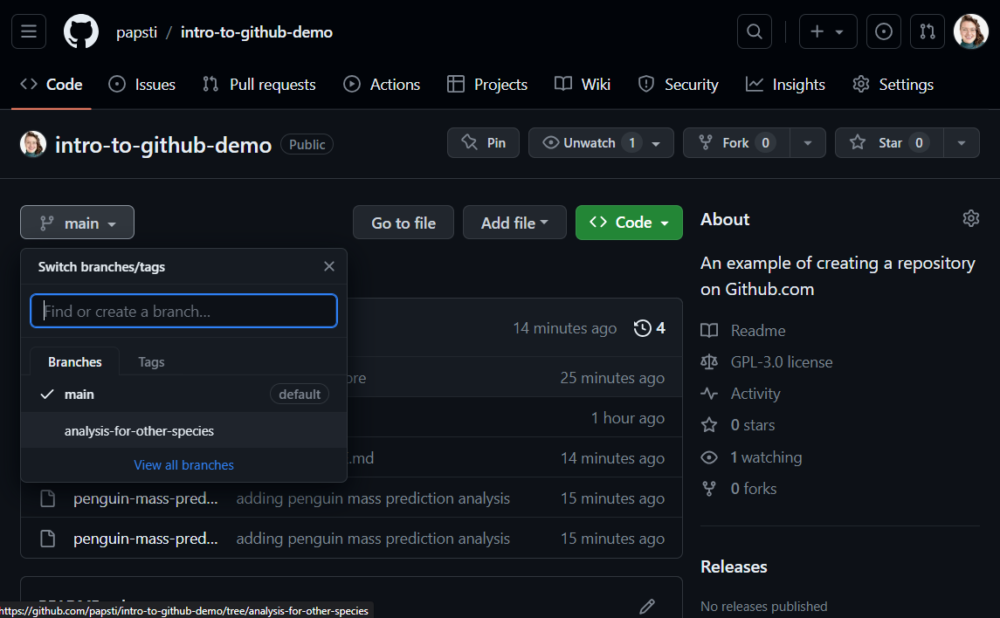

### Merge/pull request

As suggested above, before creating a pull request (or "merge request" in GitLab), you will want to ensure your branch is up-to-date with the branch you're merging into (usually `main`) and resolve any conflicts. You can do so by starting on your new branch, *e.g.* `add-methods`, opening the branch menu in GitHub Desktop, and selecting the button at the bottom that would say "Choose a branch to merge into **`add-methods`**". Here you would select `main` and then resolve any merge conflicts as explained above. Finish by pushing those changes up to the origin (cloud) repository.

Once you've synchronized your new branch with the base branch of your pull request, you can open a pull request.

For repositories connected to GitHub, you should use [these instructions for creating a pull request from GitHub Desktop](https://docs.Github.com/en/desktop/working-with-your-remote-repository-on-Github-or-Github-enterprise/creating-an-issue-or-pull-request-from-Github-desktop#creating-a-pull-request). For repositories connected to GitLab, you should use [these instructions for creating a merge request from the merge request list on the GitLab website](https://docs.gitlab.com/ee/user/project/merge_requests/creating_merge_requests.html#from-the-merge-request-list).

Once the request is created, it can be reviewed and merged online:

-   GitLab: [reviewing](https://docs.gitlab.com/ee/user/project/merge_requests/reviews/) and merging merge requests
    -   To merge, simply [find your request](https://docs.gitlab.com/ee/user/project/merge_requests/index.html#view-merge-requests) in the project repository online on GitLab, open it, and click the merge button at the bottom.
-   GitHub: [reviewing](https://docs.github.com/en/pull-requests/collaborating-with-pull-requests/reviewing-changes-in-pull-requests/about-pull-request-reviews) and [merging](https://docs.github.com/en/pull-requests/collaborating-with-pull-requests/incorporating-changes-from-a-pull-request/merging-a-pull-request?tool=webui#merging-a-pull-request) pull requests

Be sure to synchronize local repositories after merges. You may also want to delete the new branch that was merged if it has served its purpose (both locally and in the cloud repository), which you can do easily from GitHub Desktop for GitHub repositories:

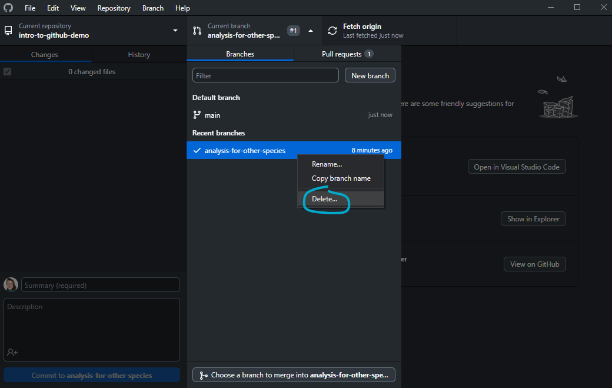 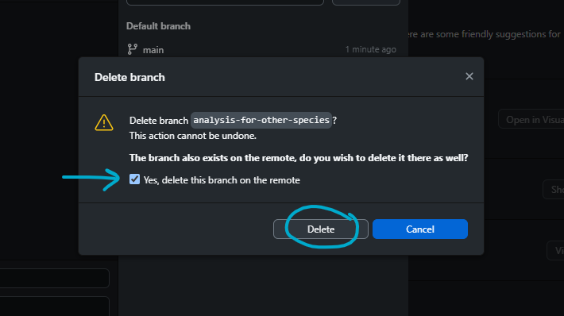

## Git workflow

### GitHub flow {#github-flow}

Git, GitLab, and GitHub are very flexible pieces of software and it's possible to use them in many different ways. We recommend the use of [GitHub flow](https://docs.Github.com/en/get-started/quickstart/Github-flow)[^3], which is a straightforward and simple workflow. Here is an overview:

[^3]: GitHub flow is very similar in spirit to trunk-based development. You can learn more about this approach and the motivation behind it [here](https://trunkbaseddevelopment.com/).

1.  For any new addition to your code (new feature, bug fix, etc), **create a new branch** locally based off of `main`. We will call this the "feature branch". Pick a branch name that quickly conveys its purpose.
2.  **Push your feature branch to the remote (cloud) repository** as a back up and so that anyone you're collaborating with on this new feature can check the branch out locally too.
3.  **Make changes** to your code and commit them into the feature branch.
4.  Once you've completed the task you set out address with this feature branch, pull the latest version of the `main` branch from the remote repository into your new feature branch and **resolve any merge conflicts**.
5.  **Submit a pull request** (or a merge request on GitLab) to merge your feature branch into `main`. Optionally request a review from a collaborator. Address reviewer comments and make further changes by pushing to the feature branch (these changes will be appended to the pull request). Ideally the review does not take long so that there are no further changes to the main branch in the meantime, but if it does, you may have to pull the `main` branch into the feature branch once more to resolve any merge conflicts before completing the merge into `main`.
6.  When the review is complete, **accept the pull request** and merge the changes into the main branch.
7.  **Delete the new feature branch** (on both the remote repository and your local copy).

In this workflow, you should strive to create branches that are meant to address a non-trivial issue (*e.g.* more than simply a typo fix), but that require work that won't take more than a few days. This way, collaborators reviewing your work will have enough to react to without being overwhelmed, and you will not diverge so much from the default branch that when it comes time to merge your new work into `main`, you won't have too much to reconcile (even if your collaborators have also merged into `main` since you last branched off).

You should be able to use GitHub Flow via GitHub Desktop and GitLab/GitHub online with the instructions in the [Git basics](#git-basics) section. To use it via a command line environment, such as in the Git Bash app, follow the instructions [here](../extras/githubflow-demo-cli.qmd).

### Project management with GitLab and GitHub

Beyond enabling teams to collaborate in a version-controlled setting, GitHub and GitLab both offer features that make project management easy and complementary to GitHub flow. Issues (on both [GitLab](https://docs.gitlab.com/ee/user/project/issues/) and [GitHub](https://docs.github.com/en/issues/tracking-your-work-with-issues/about-issues)) are an easy way to track tasks associated with each project. Issues can be tagged with various labels, assigned to individuals, and organized further using Issue boards ([GitLab](https://docs.gitlab.com/ee/user/project/issue_board.html)) and Projects ([GitHub](https://docs.github.com/en/issues/planning-and-tracking-with-projects/learning-about-projects/about-projects)).

Issues are numbered and can be referenced in discussions on GitHub and GitLab with a hashtag followed by the issue number (*e.g.* #5). One can use these references to close completed issues automatically by using keywords in commit messages and pull requests. For instance, if a commit message includes the text "fixes #7", then issue #7 will automatically be closed when this commit is pulled into `main` in the remote repository. More information about keywords can be found [here for GitLab](https://docs.gitlab.com/ee/user/project/issues/managing_issues.html#closing-issues-automatically) and [here for GitHub](https://docs.github.com/en/issues/tracking-your-work-with-issues/linking-a-pull-request-to-an-issue#linking-a-pull-request-to-an-issue-using-a-keyword).

To enhance GitHub flow with these additional project management features, we recommend that the flow is amended to start with the creation of an Issue for which a feature branch is then created, and that keywords are used to close any Issues associated with a commit and/or pull request.

## Git tips and tricks

### Commit a (mostly) empty directory

Git is designed to track files, not directories---directories are only added to Git as a side-effect of tracking their contents. As a result, Git **cannot track and commit empty directories**.

If your code requires the existence of such a directory (e.g., a `/tmp` directory for writing temporary files, or an `/output` directory for rendering documents), your code should check for the existence of the directory, and if it's not present, create it.

However, if you can't create the directory programatically, you can instead commit a (mostly) empty directory to your repository.

#### Solution 1: README.md

Add a README.md file as a placeholder, excluding all other files in the directory. You can use the README to document the purpose of the directory (and READMEs in the first and second levels of your project are automatically rendered by Git servers on the repo website).

Create the README in the directory, then append the following lines to your project's main `.gitignore` file (in the main project directory):

```         
# To exclude the directory and its contents.
example-dir/*

# To create an exception for the README.md.
!example-dir/README.md
```

#### Solution 2: More .gitignore

`.gitignore` files can be nested, so you can add a `.gitignore`, excluding all other files in the directory.

Create the `.gitignore` file in the directory, then add the following lines **to the `.gitignore` you just created**:

```         
# To exclude the directory and its contents.
*

# But do not exclude the .gitignore (! means not)
!.gitignore
```

### Working with the repository history

**TODO** Outline various options when merging:

-   dropping repo history (snapshot approach)
-   re-writing repo history
-   maintaining repo history

Discuss considerations in each case.